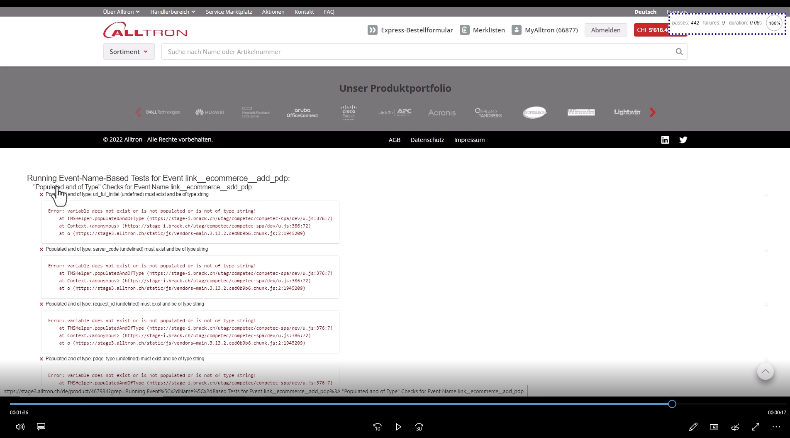
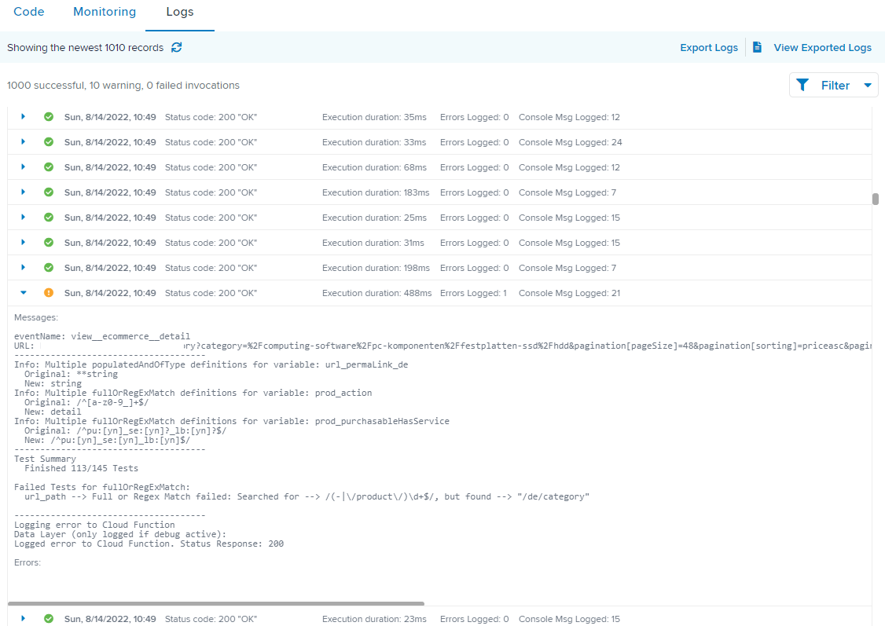
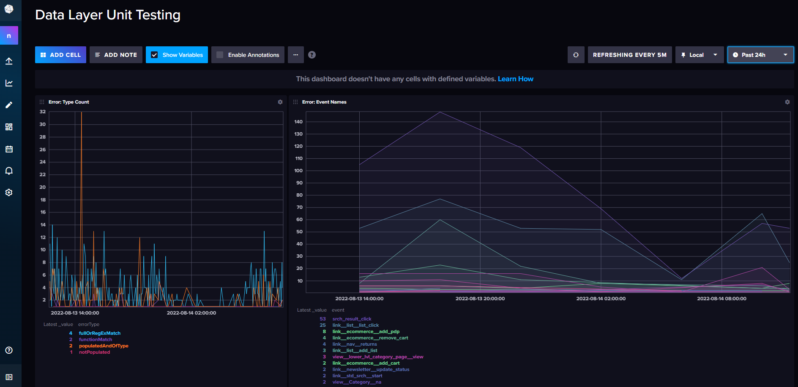
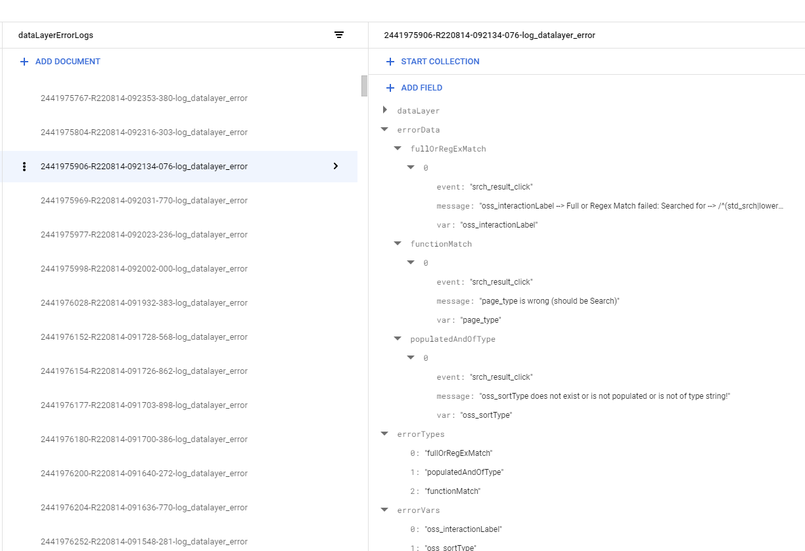

# Tealium Client-and-Server-Side Data Layer Testing Framework

## Summary

This framework validates Tealium Data Layer Events via ...

1. __Tealium iQ (`tealium-iq` folder):__ client-side for ad-hoc testing in your browser via a Mocha/Chai-JS based tag +
   Extension (folders `tealium-iq/tags` and `tealium-iq/extensions`)
2. __Tealium Functions (`tealium-functions` folder):__ server-side to test all Events of all users

Both frameworks use the same JSON-schema-based data layer test definitions (see `shared/globals`).

In the Tealium iQ (MochaChai) variant, errors are reported visually as you browse.

[YouTube video on MochaChai JS client-side data layer tests](https://www.youtube.com/watch?v=82UoFKqmZHw)

In the server-side variant, errors are logged in the Tealium Functions console and/or to your destination of choice (you
need to set this part up yourself), e.g. a Google Cloud Function + Firestore for deeper debugging and an influxDB for
monitoring.


Tealium Function Logs


InfluxDB


Google Cloud Firestore

The Tealium Functions part of this framework is a much-enhanced and partially rewritten fork of Łukasz Cieloch's draft
which you can view here: https://github.com/LukaszCieloch/automated-event-validation

## Getting started

This "getting started" guide only shows how to set up the components in Tealium. To actually benefit from these
componentes, you of course need to define the actual Data Layer tests. For this, see the chapters after this one.

### Tealium iQ (Mocha & Chai JS)

You need

1. A Tag which loads the mocha / chai JS libraries
2. An "After Tags" Extension to run the actual data layer tests

#### Tag

The Tag simply loads the Mocha and Chai JS libraries asynchronously, makes sure they are not loaded multiple times on
the same page. After successful loading, it triggers the Data Layer Tests in the Extension (see next chapter).

1. Create a new tag of type "Tealium Custom Container" and call it e.g. "MochaChai Data Layer Tests".
2. Make sure it does not fire on PROD environments and add any load rules that you want it to fire (e.g. "Any Event
   apart from some Events we do not want to run tests for (yet)").
3. Save your Tealium Profile (otherwise you cannot edit the tag template).
4. Go into the tag -> Advanced -> Tag Template.
5. Paste the code from `tealium-iq/tags/mochachai.js`
6. Save the tag.
7. Move the tag to the end of the execution order so it is ideally the last one to fire.

#### Extension

1. Create an "After Tags" Extension of type "Advanced JavaScript".
2. Add the code from `tealium-iq/extensions/mochachai-iq-extension.js`.
3. Approve the Extension to all environments where you want it to run (you should not run it on PROD).
4. The Extension should ideally be the last one in your execution order.
5. Publish your Tealium Profile.

#### Log to the console instead of the browser window (optional)

To enable logging mocha test results to the console instead of the browser window, you can set a cookie "mocha2console"
to any value, e.g. by
executing this in your browser console:

```javascript
document.cookie = "mocha2console=123";
```

To change the criteria for logging to the console, change `document.cookie.indexOf("mocha2console") !== -1` in
the `tealium-iq/tags/mochachai.js` file to anything that makes sense in your case.

#### Run scenarios automatically

This framework can also be a good anchor point for automatically run scenarios like a checkout. To record and (re-)run
or export/import scenarios, you can use Chrome
Recorder, part of Chrome’s Developer Tools. Check out this video how to:
https://www.youtube.com/watch?v=TLJCfYltMEc

### Tealium Functions (server-side testing)

1. Create an Event Feed under Event Stream. The Event Feed should include all Events you want to run tests against (e.g.
   all Events from production environments and website X or Y)
2. Create a Tealium Function of the type "(After) Processed Event".
3. Paste and review the code from `tealium-functions/unit_test.js`.
4. Save and Publish your Customer Data Hub Profile.

### Gulp Build Functionality

To benefit from the automatic building of the JS test map and shared helper functions via `gulp`, run `npm install` and
check the last chapter in this guide.

## Event Names

All tests are triggered by __Event Names__. The Event Name is identified via the Data Layer variable `event_name`. An
Event Name is whatever you define it to be. An example could be a concatenation (separator: \_\_ (double underscore) of:

* the Tealium Event ("view"/"link") plus
    * `component_category` + "_" + `component_subcategory`
        * or `page_type`
            * or "na" if neither of the above (unspecific pageviews)

__Examples:__

* `link__srchFilter__select`
* `view__ecommerce__purchase`

The script will look if there is a test defined for the given Event Name in the testing map (`TMSHelper.event2DLVarMap`)
. If so, it imports the test schema and execute the test.

#### The `allEvents` and `allProdEvents` Tests

Even if an event name has no specific test defined yet, the `allEvents` test will always run. Similarly, if an Event has
a `prod_id` property, it is assumed that this is a product-specific Event, so the `allProdEvents` test will also run. In
these "all-encompassing" tests, you should specify all the variables that should always be there and what they are
expected to look like.

This allows you to reduce the event-specific test definitions to only those variables that are different for that
particular event. So the more you handle in the allEvents and allProdEvents tests, the more you can scale your tests and
avoid redundancies.

### What is a good Event Name?

Make sure to define your event names not too granularly so you don't need to write too many tests for very similar
events (see "Importing (referencing) other test definitions" below on how to set up your test definitions with as little
redundancy as possible)). E.g. an event name containing the URL Path is too low-granular, because it would assume that
every page has its own data layer test.

## Test Schemas ("globals")

The actual test schemas (in the `shared/globals` folder) are JSON files named after the event name + `.json`,
e.g. `view__ecommerce__purchase.json`. Some examples have been provided in that folder for you to get started. The
actual test definitions in your case of course depend on your specific data layer.

For example, this is how the test schema could look like for PDP Views:

```json
{
  "import": [
    "ecommerceGeneralTemplate"
  ],
  "eventSchema": {
    "populatedAndOfType": {
      "url_permaLink_de": "string",
      "order_id": "!!"
    },
    "fullOrRegExMatch": {
      "prod_action": "detail",
      "prod_id": "/\\d+/",
      "page_type": "Product"
    },
    "functionMatch": {
      "prod_cat_l1": "checkCategoryNames"
    }
  }
}
```

See the following paragraphs to illustrate this example:

### Importing (referencing) other test definitions

The `eventSchema` property is used to define the test schema for the given event. It _overrides any other imported
definitions_.

The `eventSchema` property is mandatory if the schema requires imports. If there are no imports, you can directly write
the test definitions (without `eventSchema` around them).

The `import` property is used to import entire predefined test schemas. Here, we import the `ecommerceGeneralTemplate`
schema which could contain all variables common for all e-commerce events. This means we do not have to define commonly
shared tests in each event schema again.

You can import **multiple** test schemas. If the same data layer variable is defined in multiple imported schemas, the
definition from the last imported schema wins.

### Example for importing schemas

1. Event `ecommerce_add_pdp.json`

- defines a `fullOrRegExpMatch` (see below) test: `"var_a": "1"` (var_a has to equal "1")
- imports `["tpl_cartAddEvents"]`

2. `tpl_cartAddEvents.json`

- defines a `fullOrRegExpMatch` (see below) test: `"var_a": "2"` (var_a has to equal "2")
- defines another test: `"var_b": "/som.RegExp/"`

=> The final testSchema will be

- `"var_a": "1"` because the highest eventSchema (the first one to be loaded, in this example is `ecommerce_add_pdp`) "
  wins" in case of conflicting test definitions)
- `"var_b": "/som.RegExp/"` -> was not overridden by another definition in `ecommerce_add_pdp`

### Test Types

The test schema is a JSON file and can have the following properties (test definitions):

- `populatedAndOfType`
- `fullOrRegExMatch`
- `functionMatch`

They are explained as follows:

#### populatedAndOfType

Checks if the data layer variable is populated and of the given type. Supported types are JS return values of `typeof` (
e.g. "object", "string") plus "array". The Helper Function (in `templates/helpers`) `TMSHelper.typeOf` is for this. It
mimicks Tealium's own `ut.typeOf` function.

**Special Commands:**

* `**` = "optional". Example: `"url_permaLink_de": "**string"` (url_permaLink is not mandatory, but if it is part of the
  data layer, it has to be a string)
* `!!` = "must _not_ be populated". Example: `"order_id": "!!"`. Test passes if the given data layer variable is not
  populated (
  not `undefined, null, "", false, []`).
* switch statements (if var a == b, then c == d): see Logical Tests (Switch Statements) below

Example:

```json
{
  "populatedAndOfType": {
    "url_permaLink_de": "string",
    "prod_action": "array",
    "user_debid": "**string",
    "order_id": "!!"
  }
} 
```

#### fullOrRegExMatch

Checks ...

* if a data layer variable's value matches the given Regular Expression (string starting and ending with "/",
  e.g. `"variable": "/^Regexp-as-string\\! So-Backslashes-need-to-be-doublescaped$/"`)
* or is equal to the given value (`"variable": "exactlyThisValuePlease"`)

It is also possible to add links to predefined Regular Expressions with `//name`. The Regexes are stored in the
TMSHelper Object and you can add to them by changing the `shared/templates/helpers.js` file. For
example, `"//positiveInt"` will check `TMSHelper.positiveInt`. If the definition of TMSHelper.positiveInt (a positive
integer number) ever changes, you don't need to update all test schemas using it.

Example:

```json
{
  "fullOrRegExMatch": {
    "prod_action": "detail",
    "prod_stock": "/^(n|[1-9]\\d*)$/",
    "page_type": "Product",
    "prod_id": "//positiveInt"
  }
}
```

##### Logical Tests (Switch Statements)

In more complex cases, you can use switches to check if a given data layer variable's value matches the given RegEx
depending on the given switch Key. This works for `populatedAndOfType` and `fullOrRegExMatch`.

Example below: Check url_rootDomain and switch on `ut.profile`. The `default` allows
you to specify a fallback (in case `ut.profile` does not match any of the other values provided).

Example:

```json
{
  "fullOrRegExMatch": {
    "url_rootDomain": {
      "switch": {
        "ut.profile": {
          "main": "maindomain.ch",
          "profile2": "/(value1|value2|value3)\\.ch/",
          "anotherprofile": "/(value4|value5)\\.ch/",
          "default": "unexpected domain"
        }
      }
    }
  }
}
```

#### functionMatch

For more complex logic, the functionMatch logic allows to run a custom JS function that must be part of the
`TMSHelper.functionMatchFunctions` object (see `template/helpers`). Functions must return `true` or `false` if the test
is (not) passed.

```json
{
  "functionMatch": {
    "page_type": "validatePageTypeOnSearch"
  }
}
```

This will run `TMSHelper.functionMatchFunctions.validatePageTypeOnSearch(eventData, "value of page_type")`

### Array Variables

If your variable to test is an array (e.g. for product list tracking), don't worry. The tests will automatically
validate **every Array element**.

### Ignore Variables by Tealium Profile

In many cases, you want to ignore certain data layer variables on a specific platform (=Tealium Profile). For this, you
add this variable to the `TMSHelper.ignoreKeysForPlatform` ignore list (in `shared/templates/helpers.js`):

```javascript
TMSHelper.ignoreKeysForPlatform = {
    "profile1": ["variable_that_never_exists_on_profile1"],
    "profile2": [
        "cp.a_cookie_variable_that_never_exists_on_profile2",
        "some_other_variable_that_never_exists_on_profile2"
    ]
};
```

In the example above, if the data layer Event is sent from Tealium profile "profile2", no data layer tests will be run
for variables `cp.a_cookie_variable_that_never_exists_on_profile2`
and `some_other_variable_that_never_exists_on_profile2`.

## Error Logging

### Tealium Function Logs

At the end of the Test Script, the `error` object and some context messages are printed to the Tealium logs if it
contains errors. Filter the logs for "Exceptions" to see all failed tests.


## Gulp Workflows

Gulp Workflows are used to automatically put all the pieces together without tedious copy-paste effort.
Run `npm install` to install the necessary libraries and dependencies from package.json.

### Full Build

Run `gulp build` to

* generate concatenated Event Map JS Object and JSON files as well as minified versions of them
* insert the updated Event Map into the Tealium Function (`functions/unit_test.js`)
* update the helper functions in both the Mocha Extension and the Tealium Function

The following explains each of the `build` actions:

### Generate concatenated Event Map File

Concatenates all JSON test schemas into one file (`shared/templates/eventMap.js` and `...json`).

After changing any test definition, you can run this task individually via `gulp generateEventMap`.

### Insert updated Event Map into Tealium Function (unit_test.js)

`gulp updateTFMap`
This updates the Tealium Function (unit_test.js) with `eventMap.min.js`.

### Update shared Helper Functions

The client-side Mocha tests share most Helper functions with the server-side Tealium functions. To avoid duplicate
maintenance effort, the shared functions are located in `shared/templates/helpers.js`. Only edit them there.

After updates to the helper functions, this task re-inserts them (in minified form) into the MochaChai Extension and the
Tealium Function (unit_test.js). You can trigger it via

`gulp updateHelpers`

### Don't forget to update Tealium itself

After running any of the tasks above, make sure to update the actual Tealium Function Code in the Tealium Customer Data
Hub and the Tealium iQ MochaChai Extension with the updated code.

## Support / Questions

Raise your questions in this repo or via email to lukas.oldenburg at dim28.ch.