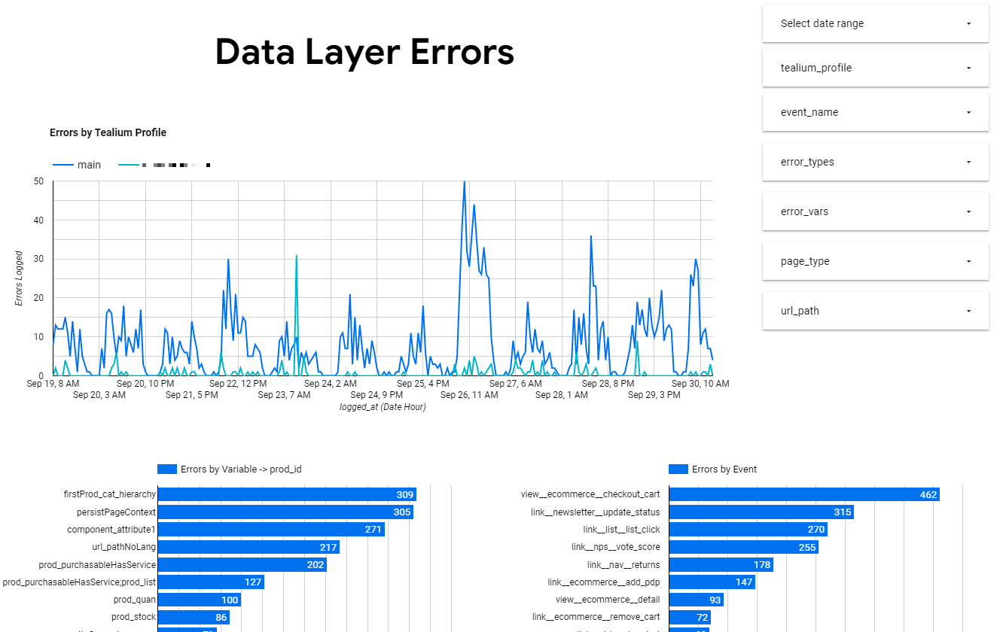
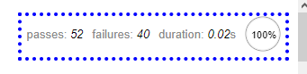

# Tealium Client-and-Server-Side Data Layer Testing Framework

# Meta

This is the repository with the Tealium iQ- & Tealium CDP-related code for the client-and-server-side data layer testing
framework presented in this article series:

* https://thebounce.io/the-issues-of-tracking-qa-solutions-and-what-a-better-one-could-look-like-a883ed527b1
* https://thebounce.io/using-mocha-chai-js-tealium-for-client-side-data-layer-testing-9eea7807942a
* https://thebounce.io/use-your-server-side-tms-to-qa-your-data-collection-in-the-real-world-7137376ca9a9

For the Python code and step-by-step guide to set up the **Google Cloud Platform** part of the framework,
see https://github.com/loldenburg/datalayertests-gcp

## Summary

This framework validates Tealium Data Layer Events via ...

1. __Tealium iQ (`tealium-iq` folder):__ client-side for ad-hoc testing in your browser via a Mocha/Chai-JS based tag +
   Extension (folders `tealium-iq/tags` and `tealium-iq/extensions`)
2. __Tealium Functions (`tealium-functions` folder):__ server-side to test all Events of all users

Both frameworks use the same JSON-schema-based data layer test definitions (see `shared/globals`).

In the Tealium iQ (MochaChai) variant, errors are reported visually as you browse.

[YouTube video on MochaChai JS client-side data layer tests](https://www.youtube.com/watch?v=82UoFKqmZHw)

In the server-side variant, errors are logged in the Tealium Functions console and/or to your destination of choice (you
need to set this part up yourself), e.g. a Google Cloud Function + Firestore for deeper debugging + BigQuery & Data
Studio or an influxDB / Grafana dashboard for monitoring.


Tealium Function Logs


InfluxDB


Google Cloud Firestore


Data Studio (via BigQuery)

The Tealium Functions part of this framework is a much-enhanced and partially rewritten fork of Łukasz Cieloch's draft
at https://github.com/LukaszCieloch/automated-event-validation

## Getting started

This "getting started" guide only shows how to set up the components in Tealium. To actually benefit from these
components, you of course need to define the actual Data Layer tests. For this, see the chapters after this one.

### Tealium iQ (Mocha & Chai JS)

You need

1. A Tag which loads the mocha / chai JS libraries
2. 2 Pre-Loader Extensions:
   a) one to define the tests (unless you load them as a JS file into Tealium e.g. via Google Cloud Storage or another
   CDN)
   b) one to run the tests
3. Depending on your setup, you also need an "All Tags" Extension that defines the `event_name`. The Event Name is the
   identifier that defines which
   tests are run

#### Mocha Chai JS Tag

The Tag simply loads the Mocha and Chai JS libraries asynchronously and makes sure they are not loaded multiple times on
the same page. After successful loading, it triggers the Data Layer Tests in the Extension (see next chapter).

1. Create a new tag of type "Tealium Custom Container" and call it e.g. "MochaChai Data Layer Tests".
2. Uncheck the "PROD" environment so the tag never fires on production (unless you want that)
3. Go into the tag -> Advanced -> Tag Template.
4. Paste the code from `tealium-iq/tags/mochachai.js` and click "Apply"
5. Add any Load Rules to further restrict the test execution further (e.g. only if a certain "testing cookie" is active)
6. Save the tag.
7. Move the tag to the **end of the execution order** so it is the last one to fire.

#### Extensions

a) Mocha Chai JS Tests Definition and Helper Functions

1. Create a "Pre-Loader" Extension of type "Advanced JavaScript" and name it "MochaChai Data Layer Test Map & Helpers"
2. Add the code from `tealium-iq/extensions/eventMapAndHelpers.js`.
3. Approve the Extension to all environments where you want it to run (you should not run it on PROD).

b) Mocha Chai JS Tests Runner

1. Create another "Pre-Loader" Extension of type "Advanced JavaScript".
2. Add the code from `tealium-iq/extensions/mochachai-iq-extension.js`.
3. Approve the Extension to all environments where you want it to run (you should not run it on PROD).
4. Make sure that this Extension comes AFTER the "MochaChai Data Layer Test Map & Helpers" created under a)

c) All Tags Extension (optional) to define the `event_name`

1. If you do not have an `event_name` variable in your data layer already, you need to define this variable for all Data
   Layer Events that Tealium processes. See notes further down on how to create a good event name.
2. Create an "All Tags" Extension of type "Advanced JavaScript".
3. Add the code from `tealium-iq/extensions/example-define-event-name.js` and adjust the code so it makes sense for your
   setup.

Now publish your Tealium Profile. You should be seeing the MochaChai JS tests running now.


#### Log to the console instead of the browser window (optional)

To enable logging mocha test results to the console instead of the browser window, you can set a cookie "mocha2console"
to any value, e.g. by
executing this in your browser console:

```javascript
document.cookie = "mocha2console=123";
```

To change the criteria for logging to the console, change `document.cookie.indexOf("mocha2console") !== -1` in
the tag template (`tealium-iq/tags/mochachai.js`) to anything that makes sense for your case.

#### Run scenarios automatically

This framework can also be a good anchor point for automatically run scenarios like a checkout. To record and (re-)run
or export/import scenarios, you can use Chrome
Recorder, part of Chrome’s Developer Tools. Check out this video how to:
https://www.youtube.com/watch?v=TLJCfYltMEc

### Tealium Functions (server-side testing)

This guide assumes you have a running connection already between your Tealium iQ profile and your Tealium Customer Data
Hub (CDH) profile ([see this guide
otherwise](https://community.tealiumiq.com/t5/Customer-Data-Hub/Data-Sources-for-iQ-Tag-Management/ta-p/17934)).

1. Go to Tealium CDH.
2. Create an Event Feed under Event Stream -> Live Events. The Event Feed should include all Events you want to run
   tests against (e.g.
   all Events from production environments and website X or Y).
    - If you have a lot of traffic, you might want to sample the traffic by setting a cookie to a random number between
      1 and 100 in Tealium iQ and including only those with a number higher than e.g. 80 in the stream.
3. Go to "Functions" -> Create a Tealium Function of the type "(After) Processed Event".
4. Paste the code from `tealium-functions/unit_test.js`.
5. Save and Publish your CDH Profile.

### Gulp Build Functionality

To benefit from the automatic building of the JS test map and shared helper functions via `gulp`, run `npm install` and
check the last chapter in this guide.

## Event Names

All tests are triggered by __Event Names__. The Event Name is identified via the Data Layer variable `event_name`. An
Event Name is whatever you define it to be. An example could be a concatenation (separator: \_\_ (double underscore) of:

* the Tealium Event ("view"/"link") plus
    * `component_category` + "_" + `component_subcategory`
        * or `page_type`
            * or "na" if neither of the above (unspecific pageviews)

__Examples:__

* `link__srchFilter__select`
* `view__ecommerce__purchase`

The Data Layer Test code will look if there is a test defined for the given Event Name in the testing
map (`TMSHelper.event2DLVarMap`)
. If so, it imports the test schema and execute the test.

#### The `allEvents` and `allProdEvents` Tests

Even if an event name has no specific test defined yet, the `allEvents` test will always run. Similarly, if an Event has
a `prod_id` property, it is assumed that this is a product-specific Event, so the `allProdEvents` test will also run. In
these "all-encompassing" tests, you should specify all the variables that should always be there and what they are
expected to look like.

This allows you to reduce the event-specific test definitions to only those variables that are different for that
particular event. So the more you handle in the allEvents and allProdEvents tests, the more you can scale your tests and
avoid redundancies.

### What is a good Event Name?

Make sure to define your event names not too granularly so you don't need to write too many tests for very similar
events (see "Importing (referencing) other test definitions" below on how to set up your test definitions with as little
redundancy as possible)). E.g. an event name containing the URL Path is too low-granular, because it would assume that
every page has its own data layer test.

## Test Schemas ("globals")

The actual test schemas (in the `shared/globals` folder) are JSON files named after the event name + `.json`,
e.g. `view__ecommerce__purchase.json`. Some examples have been provided in that folder for you to get started. The
actual test definitions in your case of course depend on your specific data layer.

For example, this is how the test schema could look like for PDP Views:

```json
{
  "import": [
    "ecommerceGeneralTemplate"
  ],
  "eventSchema": {
    "populatedAndOfType": {
      "url_permaLink_de": "string",
      "order_id": "!!"
    },
    "fullOrRegExMatch": {
      "prod_action": "detail",
      "prod_id": "/\\d+/",
      "page_type": "Product"
    },
    "functionMatch": {
      "prod_cat_l1": "checkCategoryNames"
    }
  }
}
```

See the following paragraphs to illustrate this example:

### Importing (referencing) other test definitions

The `eventSchema` property is used to define the test schema for the given event. It _overrides any other imported
definitions_.

The `eventSchema` property is mandatory if the schema requires imports. If there are no imports, you can directly write
the test definitions (without `eventSchema` around them).

The `import` property is used to import entire predefined test schemas. Here, we import the `ecommerceGeneralTemplate`
schema which could contain all variables common for all e-commerce events. This means we do not have to define commonly
shared tests in each event schema again.

You can import **multiple** test schemas. If the same data layer variable is defined in multiple imported schemas, the
definition from the last imported schema wins.

### Example for importing schemas

1. Event `ecommerce_add_pdp.json`

- defines a `fullOrRegExpMatch` (see below) test: `"var_a": "1"` (var_a has to equal "1")
- imports `["tpl_cartAddEvents"]`

2. `tpl_cartAddEvents.json`

- defines a `fullOrRegExpMatch` (see below) test: `"var_a": "2"` (var_a has to equal "2")
- defines another test: `"var_b": "/som.RegExp/"`

=> The final testSchema will be

- `"var_a": "1"` because the highest eventSchema (the first one to be loaded, in this example is `ecommerce_add_pdp`) "
  wins" in case of conflicting test definitions)
- `"var_b": "/som.RegExp/"` -> was not overridden by another definition in `ecommerce_add_pdp`

### Test Types

The test schema is a JSON file and can have the following properties (test definitions):

- `populatedAndOfType`
- `fullOrRegExMatch`
- `functionMatch`

They are explained as follows:

#### populatedAndOfType

Checks if the data layer variable is populated and of the given type. Supported types are JS return values of `typeof` (
e.g. "object", "string") plus "array". The Helper Function (in `templates/helpers`) `TMSHelper.typeOf` is for this. It
mimicks Tealium's own `ut.typeOf` function.

**Special Commands:**

* `**` = "optional". Example: `"url_permaLink_de": "**string"` (url_permaLink is not mandatory, but if it is part of the
  data layer, it has to be a string)
* `!!` = "must _not_ be populated". Example: `"order_id": "!!"`. Test passes if the given data layer variable is not
  populated (
  not `undefined, null, "", false, []`).
* switch statements (if var a == b, then c == d): see Logical Tests (Switch Statements) below

Example:

```json
{
  "populatedAndOfType": {
    "url_permaLink_de": "string",
    "prod_action": "array",
    "user_debid": "**string",
    "order_id": "!!"
  }
} 
```

#### fullOrRegExMatch

Checks ...

* if a data layer variable's value matches the given Regular Expression (string starting and ending with "/",
  e.g. `"variable": "/^Regexp-as-string\\! So-Backslashes-need-to-be-doublescaped$/"`)
* or is equal to the given value (`"variable": "exactlyThisValuePlease"`)

It is also possible to add links to predefined Regular Expressions with `//name`. The Regexes are stored in the
TMSHelper Object and you can add to them by changing the `shared/templates/helpers.js` file. For
example, `"//positiveInt"` will check `TMSHelper.positiveInt`. If the definition of TMSHelper.positiveInt (a positive
integer number) ever changes, you don't need to update all test schemas using it.

Example:

```json
{
  "fullOrRegExMatch": {
    "prod_action": "detail",
    "prod_stock": "/^(n|[1-9]\\d*)$/",
    "page_type": "Product",
    "prod_id": "//positiveInt"
  }
}
```

##### Logical Tests (Switch Statements)

In more complex cases, you can use switches to check if a given data layer variable's value matches the given RegEx
depending on the given switch Key. This works for `populatedAndOfType` and `fullOrRegExMatch`.

Example below: Check url_rootDomain and switch on `ut.profile`. The `default` allows
you to specify a fallback (in case `ut.profile` does not match any of the other values provided).

Example:

```json
{
  "fullOrRegExMatch": {
    "url_rootDomain": {
      "switch": {
        "ut.profile": {
          "main": "maindomain.ch",
          "profile2": "/(value1|value2|value3)\\.ch/",
          "anotherprofile": "/(value4|value5)\\.ch/",
          "default": "unexpected domain"
        }
      }
    }
  }
}
```

#### functionMatch

For more complex logic, the functionMatch logic allows to run a custom JS function that must be part of the
`TMSHelper.functionMatchFunctions` object (see `template/helpers`). Functions must return `true` or `false` if the test
is (not) passed.

```json
{
  "functionMatch": {
    "page_type": "validatePageTypeOnSearch"
  }
}
```

This will run `TMSHelper.functionMatchFunctions.validatePageTypeOnSearch(eventData, "value of page_type")`

### Array Variables

If your variable to test is an array (e.g. for product list tracking), don't worry. The tests will automatically
validate **every Array element**.

### Ignore Variables by Tealium Profile

In many cases, you want to ignore certain data layer variables on a specific platform (=Tealium Profile). For this, you
add this variable to the `TMSHelper.ignoreKeysForPlatform` ignore list (in `shared/templates/helpers.js`):

```javascript
TMSHelper.ignoreKeysForPlatform = {
    "profile1": ["variable_that_never_exists_on_profile1"],
    "profile2": [
        "cp.a_cookie_variable_that_never_exists_on_profile2",
        "some_other_variable_that_never_exists_on_profile2"
    ]
};
```

In the example above, if the data layer Event is sent from Tealium profile "profile2", no data layer tests will be run
for variables `cp.a_cookie_variable_that_never_exists_on_profile2`
and `some_other_variable_that_never_exists_on_profile2`.

## Error Logging

### Tealium Function Logs

At the end of the Test Script, the `error` object and some context messages are printed to the Tealium logs if it
contains errors. Filter the logs for "Exceptions" to see all failed tests.


## Gulp Workflows to automatically build the Test Maps after changes

Gulp Workflows are used to automatically put all the pieces together without tedious copy-paste effort.
Run `npm install` once to install the necessary libraries and dependencies from package.json.

### Full Build
After changing a test definition or a helper function, simply run `gulp build` from your terminal. 
After that, you only need to 
a) copy the updated `tealium-iq/extensions/eventMapAndHelpers.js` to the corresponding Extension in Tealium iQ.
b) update your Tealium Function with updated `tealium-functions/unit_tests.js` file.  

### More Details
If you want to find out more about the Gulp Workflows, read on.

`gulp build` actually does the following things:

1. update the shared helper functions (including the functions used for "Function Matches" tests) used by both Mocha and
  Tealium Functions
2. generate a concatenated Event Map JS Object by concatenating all .json files (all test schemas) in `shared/globals` 
3. Inserts both the as well as minified versions of them and inserts them also into `extensions/eventMapAndHelpers.js` Extension
4. Insert the updated Event Map into the Tealium Function (`functions/unit_test.js`)

The following explains each of the `build` actions:

#### 1. Update shared Helper Functions

The client-side Mocha tests share most Helper functions with the server-side Tealium functions. To avoid duplicate
maintenance effort, the shared functions are located in `shared/templates/helpers.js`. Only edit them there.

After updates to the helper functions, this task also re-inserts them (in minified form) into the Tealium Function (
unit_test.js). 

You can trigger the task individually via `gulp updateHelpers`.

#### 2 and 3. Generate concatenated Event Map & Helpers Files

Concatenates all JSON test schemas and Helper Functions into one file (`shared/templates/eventMap.js`
and `eventMapAndHelpers.js` plus minified versions).
The `eventMapAndHelpers.min.js` is also copied to `tealium-iq/extensions/eventMapAndHelpers.js`. After that, you can
simply copy the code from there to the "Event Map & Helpers" Extension in Tealium.

#### 4. Insert updated Event Map into Tealium Function (unit_test.js)

Updates the Tealium Function (unit_test.js) with `eventMap.min.js`.
`gulp updateTFMap`

## Support / Questions

Raise your questions in this repo or via email to lukas.oldenburg at dim28.ch.